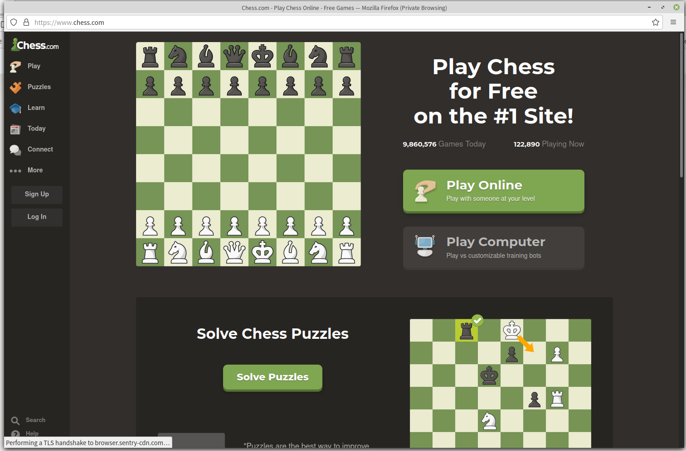
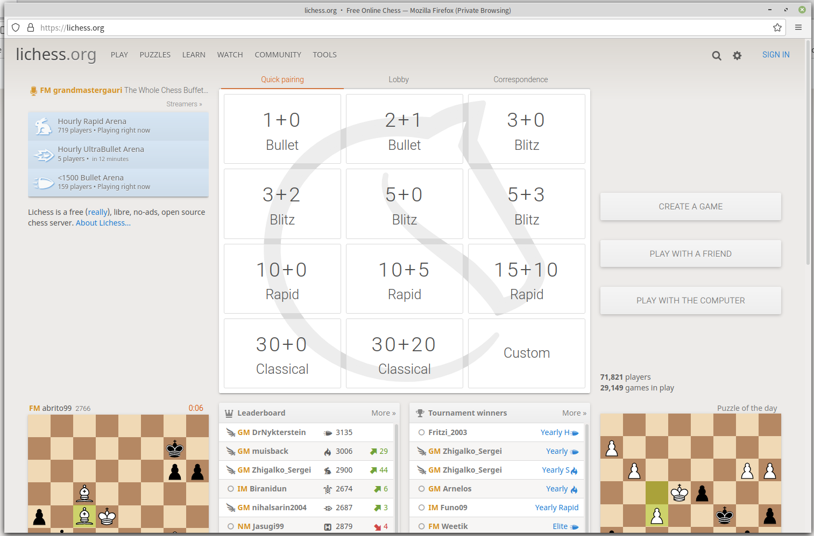
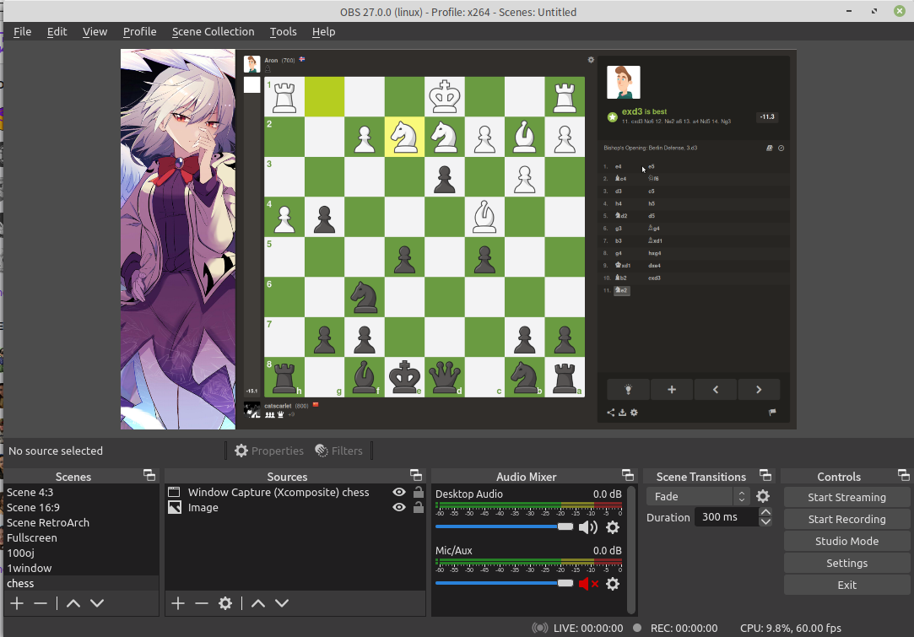

# Chess Website Opener

Just an opener to open chess.com/lichess.org in browser in minimal.

To help with getting better layout when using OBS.

## Screenshot







## Document


The key is

```
window.open(url, '_blank', 'toolbar=no, menubar=no, width=1500, height=920, noopener=yes');
```

Not a big deal.

Well it's just less blank when using 1500:920.

Now you can use OBS to catch chess.com in minimal browser with crop:

- Top: 40
- Left: 140
- Right: 0
- Bottom: 0

(Use ublock to remove the ads on the right side).

Well I wrote it in a hurry so it's kind of mess. It works.

## Known Issues

There are two Known issues.

- When open new window in minimal mode, it will still open in normal browser.

Because the opener doesn't change anything related to chess.com or lichess.org, it can handle nothing when chess.com or lichess.org are about to do.

- The window is still resizable.

The `resizable` attribute doesn't work well in modern browser so the `window.open` doesn't have this attribute in params. Just don't resize the window or it won't stay 1500x920.

## License

GNU AFFERO GENERAL PUBLIC LICENSE Version 3, 19 November 2007
